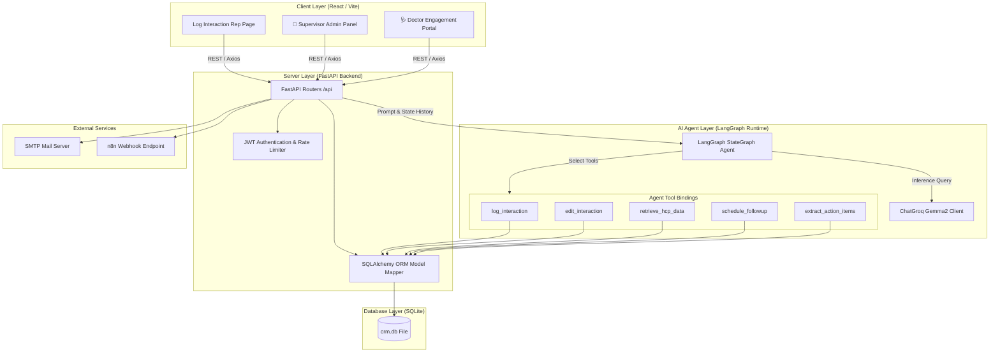

# HCP CRM Module - AI-First Engagement Workspace

A modern, AI-first Customer Relationship Management (CRM) module designed for medical representatives to log HCP (Healthcare Professional) interactions using structured forms or conversational AI via a LangGraph agent.

It features separate interfaces for medical representatives, supervisor administrators, and doctors.

---

## 🚀 Running the Project Locally

To run the application, open two separate command prompt (CMD) or PowerShell windows in the root project directory.

### 1. Start the FastAPI Backend
Open **Terminal 1** and run:
```cmd
cd backend
python -m pip install -r requirements.txt
python -m app.main
```
*Note: Ensure you copy `backend/.env.example` to `backend/.env` and add your `GROQ_API_KEY` before running.*

### 2. Start the React Frontend
Open **Terminal 2** and run:
```cmd
cd frontend
npm install
npm start
```

Once both servers are running, open your web browser and navigate to:
**`http://localhost:5173/`**

---

## 🔑 Portal Access Routes

Different access portals are exposed securely behind specific URL query parameters:

| Portal | URL Route | Description | Credentials |
| :--- | :--- | :--- | :--- |
| **Representative Workspace** | `http://localhost:5173/` | Default view for medical reps to log interactions and chat with the LangGraph copilot. | Rep Code: `12345` (OTP code validation) |
| **👑 Supervisor Admin Panel** | `http://localhost:5173/?admin=true` | Registry dashboard to manage doctor list, retrieve audit activity logs, and toggle access permissions. |
| **🩺 Doctor Engagement Portal** | `http://localhost:5173/?doctor=true` | Secure profile dashboard for doctors to sign in and review meetings, samples, and materials shared with them. |

---

## 🛠️ Project Structure
* **`backend/`**: FastAPI codebase, database schemas, SQLite connections, and the LangGraph conversational agent logic (`backend/app/agents/`).
* **`frontend/`**: Vite + React workspace, Redux store slices, styles, hooks, and responsive dashboard pages.

---

## 🏗️ System Architecture

The following diagram illustrates the complete system architecture, showing the interaction between the frontend, the FastAPI backend layer, the LangGraph agent execution runtime, and database storage:



### Components Description:
1. **Client Layer (Vite/React):** A responsive UI styled with vanilla CSS and powered by Redux Toolkit for state management. Renders conditional tabs based on URL query strings (`?admin=true` / `?doctor=true`).
2. **Server Layer (FastAPI):** Handles routing, JWT security token validation, rate-limiting lockout protections, and database connections.
3. **AI Agent Layer (LangGraph):** A stateful conversational workflow agent that parses free-form text input using tool bindings:
   * `log_interaction`: Extracts date, attendees, outcomes, sentiment, and topics from transcripts.
   * `retrieve_hcp_data`: Returns context summaries for Healthcare Professionals.
   * `schedule_followup`: Schedules notifications based on ideal frequencies.
4. **Database Layer (SQLite):** Stores persistent records for `users`, `hcps` (doctors registry), `interactions`, and representative audit activities.


THE PROJECT IS LIVE USE THIS "https://hcp-project-ft-three.vercel.app/"


